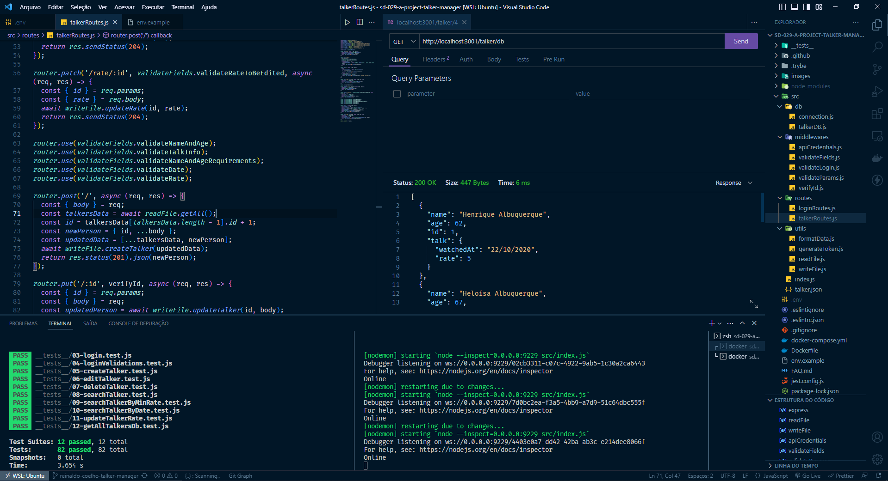
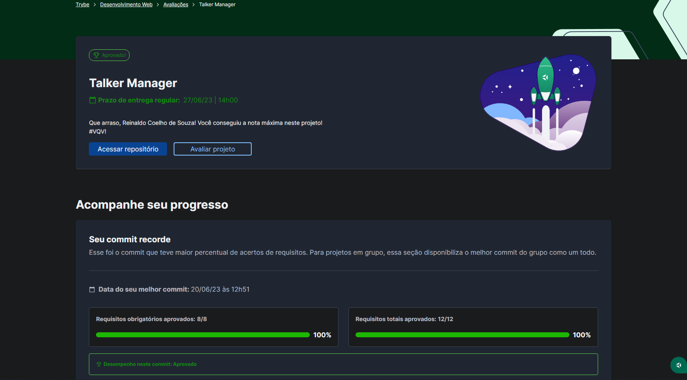

# 🎙 Talker Manager

## 📘 Sobre

Aplicação de cadastro de palestrantes na qual é possível cadastrar, visualizar, editar e excluir informações (CRUD).

## ⚛️ Ferramentas

- Node.js;
- Express.js;
- Middlewares;
- Docker;
- MySQL.

## 🛠️ Como executar o projeto?

1. Suba os containers da aplicação com `docker-compose up -d`
2. Abra o terminal do container `docker exec -it talker_manager bash`

## 📝 Nota

